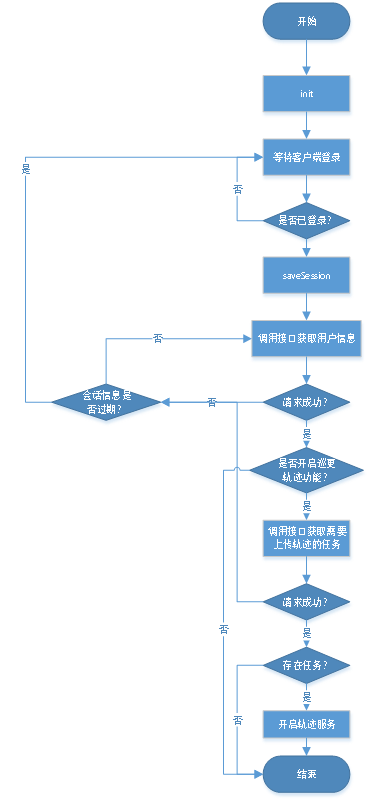

#	工单SDK接入文档

### 更新日志

+ v1.0.5

  抽离配置，以更自由的支持多平台接入

  + 移除方法saveSession(String appKey, String sessionInfo, SessionInitResultListener resultListener)，改为使用saveSession(String sessionInfo, SessionInitResultListener resultListener)进行账号初始化

  + gradle配置增加以下几项：

    ```gradle
    manifestPlaceholders = [
            BDAPP_KEY       : "百度SDK appKey",
            BDAPP_TRACKID   : "鹰眼轨迹服务ID",
            SEGI_APP_KEY    : "四格SDK appKey",
            COMPANY_PLATFORM: "平台标识",
            APP_PLATFORM    : "App标识",
            SERVER_URL      : "SDK内部接口域名",
            IMAGE_URL       : "SDK内部图片域名",
            THUMB_URL       : "SDK内部缩略图域名",
            intent_location : "包名",
    ]
    ```

+ v1.0.6

  + 移除待办不必要接口
  + 功能名称使用接口数据显示
  + 功能入口不再由客户端控制，改为后台控制
  
+ v1.0.7

  + SDK上线正式环境
  
+ v1.0.8

  + 支持关闭SDK内部对状态栏的设置，以兼容第三方应用对状态栏的全局设置，设置方法见下方`其他Api`的`statusBarSettingEnable`方法

+ v1.0.9

  + 修复选择附件弹窗未动态申请读取SD卡权限问题
  + 修复不使用内部状态栏设置情况下，图片编辑标题被遮挡问题
  
+ v1.1.0

  + 修复有偿服务支付后跳转失败问题
  + 修复任务管理顶部菜单点击失败问题


### 使用说明

####	一、SDK使用的第三方依赖库

|库名|版本|
|:--:|:--:|
|appcompat-v7|27.1.1|
|recyclerview-v7|27.1.1|
|constraint-layout|1.1.2|
|multidex|1.0.2|
|rxandroid|2.0.2|
|gson|2.8.4|
|glide|4.8.0|
|zxing|3.3.0|
|百度地图|3.5.0|
|百度鹰眼轨迹|3.0.7|

**如有版本冲突可使用Gradle exclude语法排除，如下：**
~~~
api ("xxx:xxx:xxx") {
	exclude group: 'xxx',module: 'xxx'
}
~~~
>如有排除依赖冲突后编译不通过，则需要沟通解决

####	二、Android SDK版本号
|类型|版本|
|:--:|:--:|
|minSdkVersion|15|
|compileSdkVersion|28|
|targetSdkVersion|27|

>minSdkVersion必须>=15，  compileSdkVersion必须>=28

####	三、SDK接入步骤

> 需将以前的工单SDK的aar包删除

该版本以远程依赖方式接入：
* 顶部Gradle配置

  ```
allprojects {
      repositories {
          maven {
              url 'https://maven.aliyun.com/repository/public'
          }
          maven {
              credentials {
                  username 'xxx'//账号密码需要私聊
                  password 'xxx'
              }
              url 'https://repo.rdc.aliyun.com/repository/106988-release-DvKrLL/'
        }
      }
}
  ```
  
* 接入SDK所在Module的Gradle配置（对应3.9.5版本）
~~~gradle
api "com.uhomebk:sdk:1.1.0"
~~~~
>本次版本由于修改了SegiOperatorHelper类所在包名，需要重新Import
+ 增加对renderscript的配置

```gradle
renderscriptTargetApi 18
renderscriptSupportModeEnabled true
```

+ 增加相关参数配置

```gradle
manifestPlaceholders = [
        BDAPP_KEY       : "百度SDK appKey",
        BDAPP_TRACKID   : "鹰眼轨迹服务ID",
        SEGI_APP_KEY    : "四格SDK appKey",
        COMPANY_PLATFORM: "平台标识",
        APP_PLATFORM    : "App标识",
        SERVER_URL      : "SDK内部接口域名",
        IMAGE_URL       : "SDK内部图片域名",
        THUMB_URL       : "SDK内部缩略图域名",
        intent_location : "包名",
]
```

+ 如遇到以下错误

  <font color="red">More than one file was with OS independent path 'lib/mips/libRSSupport.so'</font>

  请在当前Gradle中增加以下配置：

  ```gradle
  packagingOptions {
          exclude 'lib/mips/libRSSupport.so'
          exclude 'lib/mips/librsjni.so'
  }
  ```

  

* SDK初始化流程
	* 需在Application中初始化：
	  `SegiOperatorHelper.init(Application context, boolean isDebug)`
	
	* 用户登录后调用以下方法传递会话信息给SDK并监听初始化结果：
	  `SegiOperatorHelper.saveSession(String sessionInfo, SessionInitResultListener resultListener)`
	
	  sessionInfo：为第三方账号登录会话信息
	  
	  resultListener：可监听初始化结果
  
  * 监听会话信息过期可调用以下方法来监听：
	  `SegiOperatorHelper.addExpiredSessionListener(ExpiredSessionListener listener)`
	
  * 监听待办工单数量可调用以下方法来监听：
	    `SegiOperatorHelper.addPendingOrderNumListener(PendingOrderNumListener listener)`
	
	* 取消监听待办工单数量可调用以下方法：
	  `SegiOperatorHelper.removePendingOrderNumListener(PendingOrderNumListener listener)`
	
	* 用户退出登录或者会话信息过期，则需要调用以下方法取消所有监听以及暂停其他服务：
	  `SegiOperatorHelper.destroy()`
	
* 消息推送类型及相关方法调用
	* 消息体
	~~~
	{
  "categoryId": "1",
  "communityId": "67",
  "content": "新有偿类型",
  "contentType": "1",
  "description": "您有1条新的工单待处理，请及时处理",
  "from": "4",
  "instCode": "SERVICE_PAGE_MSG",
  "isCustomized": "0",
  "isSupervise": "0",
  "msgType": "1",
  "noticeType": "4",
  "objectId": "2251799914724820",
  "organId": "67",
  "reminder": "1",
  "serviceId": "2251799914724820",
  "templateName": "新有偿类型",
  "title": "您有1条新的工单待处理，请及时处理",
  "type": "100700",
  "userType": "2",
  "voice": "new_order.wav"//声音文件名
}
	~~~
	>以下方法会返回Intent，由于不在Activity中启动，需要增加Flag（Intent.FLAG_ACTIVITY_NEW_TASK）
	
	* 100700：待办工单类型
  `SegiOperatorHelper.orderDetailIntentForPush(serviceId,organId)`

	  声音文件名：new_order.wav（新工单）、auto_hang_out_order.wav（自动解挂）、half_time_order.wav（耗时过半）、supervise_order.wav（被督办）、urgent_order.wav（被加急）、hang_up_uncheck.wav（超时未跟进）、hang_up_check.wav（待跟进）

	* 100702：知会工单类型
  `SegiOperatorHelper.notifyOrderDetailIntentForPush(serviceId,organId)`

	  声音文件名：notify_order.wav（知会）

* 1130207：流程审批-我发起的
	`SegiOperatorHelper.myOAOrderListIntentForPush()`

* 1130318：流程审批-我审核的
	`SegiOperatorHelper.oaReviewIntentForPush()`

* 600100：任务管理的计划
	`SegiOperatorHelper.planDetailIntentForPush(serviceId)`

* 600200：任务管理的任务
	`SegiOperatorHelper.taskDetailIntentForPush(serviceId)`

* 600300：任务管理的计划审批
	`SegiOperatorHelper.approvePlanIntentForPush(serviceId)`

	* 600400：任务管理的预警消息
	`SegiOperatorHelper.warnDetailIntentForPush(serviceId)`
	
	* EQUIPMENT_CHECK_MSG：设备提醒消息
	`SegiOperatorHelper.deviceAttentionIntentForPush()`


* 建议添加如下混淆代码
~~~
#segi
-dontwarn com.framework.**
-dontwarn com.uhomebk.**
-dontwarn com.czt.mp3recorder.**

-keepclassmembers class * extends com.framework.lib.net.RequestSetting {
    public <init>(int, java.lang.Object);
}

-keep class com.uhomebk.**.model.** { *; }

-keep class com.framework.lib.util.CustomFrameworkFileProvider{*;}

-keep class com.framework.lib.adapter.recycler.** {
*;
}
-keep public class * extends com.framework.lib.adapter.recycler.BaseQuickAdapter
-keep public class * extends com.framework.lib.adapter.recycler.BaseViewHolder
-keepclassmembers  class **$** extends com.framework.lib.adapter.recycler.BaseViewHolder {
     <init>(...);
}

-keep public class com.uhomebk.order.module.patrol.service.** { *; }
-keep public class com.uhomebk.order.module.order.provider.UploadDbAdapter { *; }
-keep public class com.uhomebk.order.module.order.ui.UploadDataActivity { *; }

#glide
-keep public class * implements com.bumptech.glide.module.GlideModule
-keep public class * extends com.bumptech.glide.module.AppGlideModule
-keep public enum com.bumptech.glide.load.ImageHeaderParser$** {
  **[] $VALUES;
  public *;
}

#gson
-keep class com.ke.gson.** { *; }
-dontwarn com.google.**
-keep class com.google.gson.** {*;}
-keepattributes Signature
-keep class sun.misc.Unsafe { *; }
-keepclassmembers class * implements java.io.Serializable {
    static final long serialVersionUID;
    private static final java.io.ObjectStreamField[] serialPersistentFields;
    private void writeObject(java.io.ObjectOutputStream);
    private void readObject(java.io.ObjectInputStream);
    java.lang.Object writeReplace();
    java.lang.Object readResolve();
}
-keep public class * implements java.io.Serializable {*;}
# For using GSON @Expose annotation
-keepattributes *Annotation*
# Gson specific classes
-dontwarn sun.misc.**
# Prevent proguard from stripping interface information from TypeAdapterFactory,
# JsonSerializer, JsonDeserializer instances (so they can be used in @JsonAdapter)
-keep class * implements com.google.gson.TypeAdapterFactory
-keep class * implements com.google.gson.JsonSerializer
-keep class * implements com.google.gson.JsonDeserializer
# Application classes that will be serialized/deserialized over Gson
-keep class **.model.** { *; }

#RxJava RxAndroid
-dontwarn rx.*
-keepclassmembers class rx.internal.util.unsafe.*ArrayQueue*Field* {
    long producerIndex;
    long consumerIndex;
}
-keepclassmembers class rx.internal.util.unsafe.BaseLinkedQueueProducerNodeRef {
    rx.internal.util.atomic.LinkedQueueNode producerNode;
    rx.internal.util.atomic.LinkedQueueNode consumerNode;
}
-keepclassmembers class rx.internal.util.unsafe.BaseLinkedQueueConsumerNodeRef {
    rx.internal.util.atomic.LinkedQueueNode consumerNode;
}
-keepattributes Exceptions

#okhttp3
-dontwarn com.framework.net.**
-dontwarn okio.**
-dontwarn org.conscrypt.**
-keep class com.framework.net.internal.**{*;}
-dontwarn com.framework.net.logging.**
-dontwarn org.codehaus.**

#百度地图
-keep class com.baidu.** {*;}
-keep class mapsdkvi.com.** {*;}
-dontwarn com.baidu.**
-keep class com.baidu.mapapi.** {*;}
-keep class vi.com.gdi.bgl.android.**{*;}


#序列化的实体类
-keep public class * implements java.io.Serializable {*;}
-keep class * implements android.os.Parcelable {
  public static final android.os.Parcelable$Creator *;
}
~~~
>此处不再列出除此之外的通用混淆代码

####	四、其他API

+ 枚举ResultCode有四种：
  + SUCCESS：成功
  + FAIL：失败
  + NOT_EXIST_MODULE：不存在的功能，即为配置菜单权限（已无用）
  + UNAUTHORIZED：SDK鉴权失败或获取鉴权失败，此时无法打开功能模块，推送进来的功能页面不受限制

* SegiOperatorHelper.clearCache()
>清理SDK产生的缓存文件及业务数据表数据

* SegiOperatorHelper.getCachePath(int type)
>返回指定的目录路径
>type:文件类型（1：图片加载缓存目录，2：音频文件目录，3：文档附件目录，4：图片压缩目录）

* SegiOperatorHelper.openPendingOrderPage(Context context)
>打开待办列表页面

* SegiOperatorHelper.openPendingOrderFragment()
>返回待办列表Fragment
>如承载该页面的父页面实现了onActivityResult(int requestCode, int resultCode, Intent data)方法，必须要加上super.onActivityResult(requestCode, resultCode, data)

* SegiOperatorHelper.openOrderSearchPage(Context context)
>打开工单查询页面

* SegiOperatorHelper.openOrderHistoryPage(Context context)
>打开经办工单页面

* SegiOperatorHelper.openCreateOrderPage(Context context)
>打开工单录入页面

* SegiOperatorHelper.openNotifyOrderPage(Context context)
>打开知会工单页面

* SegiOperatorHelper.openSearchUserPage(Context context)
>打开客户查询页面

* SegiOperatorHelper.openDeviceManagePage(Context context)
>打开设备管理页面

* SegiOperatorHelper.openProcessApprovalPage(Context context)
>打开流程审批页面
>@return ResultCode 如返回ResultCode.NOT_EXIST_MODULE则表示功能入口菜单未配置

* SegiOperatorHelper.openWarehouseManagementPage(Context context)
>打开仓库管理页面
>@return ResultCode 如返回ResultCode.NOT_EXIST_MODULE则表示功能入口菜单未配置

* SegiOperatorHelper.openTaskManagement(Context context)
>打开任务管理页面
>@return ResultCode 如返回ResultCode.NOT_EXIST_MODULE则表示功能入口菜单未配置

+ SegiOperatorHelper.statusBarSettingEnable(boolean)

> SDK内部状态栏设置是否开启，默认开启
>
> 如需关闭，请调用此方法传入false，且需要重写以下Style资源：
>
> ~~~xml
> <style name="CommonBg_Gray">
>     <item name="android:background">@color/common_bg</item>
> </style>
> <style name="CommonBg_White">
>     <item name="android:background">@color/white</item>
> </style>
> <style name="CommonBg_Theme">
>     <item name="android:background">@color/theme</item>
> </style>
> <style name="fitsSystemWindowsTheme">
> </style>
> ~~~


####	附SDK初始化逻辑图

